# Topic To Cover
  1. Introduction
  2. Bar Chart

#### Introduction


```python
import numpy as np
import matplotlib.pyplot as plt


%matplotlib inline 
# to visualize chart within notebook as a whole

```


```python
x = np.arange(1,10)
y = np.arange(41,50)
plt.xlabel('day')
plt.ylabel('temp')
plt.title('weather')
plt.plot(x,y,color='green', linewidth=5,linestyle = 'dashed')
```


    [<matplotlib.lines.Line2D at 0x7f6b581944d0>]


    
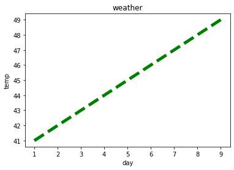
    


```python
x = np.arange(1,7)
max_t = np.array([45,43,47,41,37,38])
min_t = np.array([40,38,41,34,31,32])
avg_t = np.array([42,40,44,38,34,35])
plt.xlabel('day')
plt.ylabel('temp')
plt.title('weather')
plt.plot(x,max_t,'g+-.',label='maxT') #order doesnot matter in format
plt.plot(x,min_t,'-.r',label='minT') #order doesnot matter in format
plt.plot(x,avg_t,'y',label='avgT') #order doesnot matter in format

plt.legend(loc='lower left')
plt.grid()
```


    
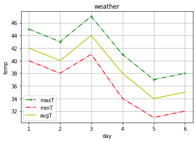
    


# Bar Chart

#### Difference between bar chart and histogram
- A bar graph is the graphical representation of categorical data using rectangular bars where the length of each bar is proportional to the value they represent.
- A histogram is the graphical representation of data where data is grouped into continuous number ranges and each range corresponds to a vertical bar.


```python
skill = ['python','sql','dw','bigdata','ML']
importance=[80,90,60,80,70]

plt.xlabel('skill')
plt.ylabel('Importance')
plt.title('demand of skill on 2022')

plt.bar(skill, importance , label="Importance" )

plt.legend()

```


    <matplotlib.legend.Legend at 0x7f6b57c94910>


    
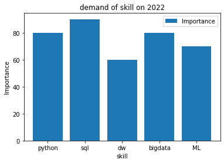
    


```python
xpos=np.arange(len(skill))

plt.bar(xpos,importance)
```


    <BarContainer object of 5 artists>


    
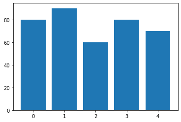
    


```python
industryusage = [40,70,30,50,10]


plt.xticks(xpos,skill)
plt.xlabel('skill')
plt.ylabel('Importance')
plt.title('demand of skill on 2022')

plt.bar(xpos, importance, label="Importance" )
plt.bar(skill, industryusage, label="industry usage")
plt.legend()
```


    <matplotlib.legend.Legend at 0x7f6b57b40890>


    
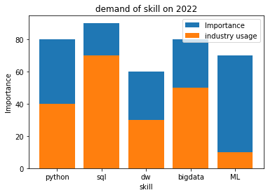
    


```python
# Split bar chart
industryusage = [40,70,30,50,10]


plt.yticks(xpos,skill)
plt.xlabel('skill')
plt.ylabel('Importance')
plt.title('demand of skill on 2022')

plt.barh(xpos-0.2, importance, label="Importance" , width = 0.4)
plt.barh(xpos+0.2, industryusage, label="industry usage", width = 0.4)
plt.legend()
```


    ---------------------------------------------------------------------------

    TypeError                                 Traceback (most recent call last)

    <ipython-input-7-3a8d48b51955> in <module>()
          8 plt.title('demand of skill on 2022')
          9 
    ---> 10 plt.barh(xpos-0.2, importance, label="Importance" , width = 0.4)
         11 plt.barh(xpos+0.2, industryusage, label="industry usage", width = 0.4)
         12 plt.legend()
    

    TypeError: barh() got multiple values for argument 'width'


    
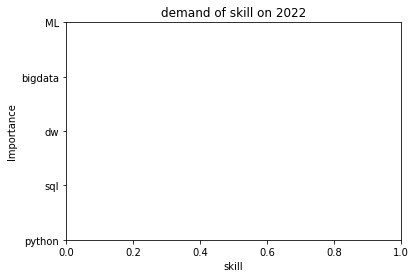
    


```python
# Horizontal Bar chart

industryusage = [40,70,30,50,10]


plt.xlabel('skill')
plt.ylabel('Importance')
plt.title('demand of skill on 2022')

plt.barh(xpos-0.2, importance, label="Importance" )
plt.barh(xpos+0.2, industryusage, label="industry usage")
plt.legend()
```


    <matplotlib.legend.Legend at 0x7f6b579ca050>


    
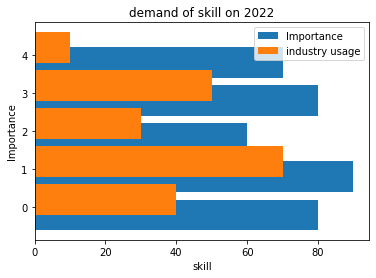
    


# Histogram
- here Y axis contain the frequency of a variable
- we uses histogram to plot continuous data variable
- now this continous varible can converte into ranges and then we can plot the bins

- we uses line chart if we want to chart contious values


```python
# by default histogram will produce 10 bins
import matplotlib.pyplot as plt
bloodsuger =[100,110,70,85, 80,113, 300, 250, 125, 167, 180,210, 90, 150, 145, 175,230, 165]

plt.hist(bloodsuger)
```


    (array([4., 3., 1., 2., 4., 0., 2., 1., 0., 1.]),
     array([ 70.,  93., 116., 139., 162., 185., 208., 231., 254., 277., 300.]),
     <a list of 10 Patch objects>)


    
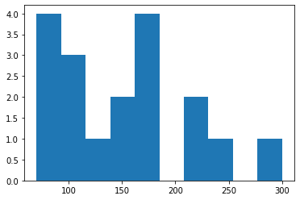
    


```python
# define no of bins
plt.hist(bloodsuger, bins=3,rwidth=0.95) 
```


    (array([9., 6., 3.]),
     array([ 70.        , 146.66666667, 223.33333333, 300.        ]),
     <a list of 3 Patch objects>)


    
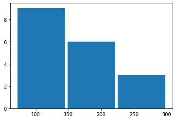
    


```python
# define bins explicitly

plt.hist(bloodsuger, bins=[80,100,125,150],rwidth=0.95,color='orange') 
```


    (array([3., 3., 3.]), array([ 80, 100, 125, 150]), <a list of 3 Patch objects>)


    
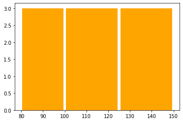
    


```python
# side by side 
import matplotlib.pyplot as plt
bloodsugerwoman=[90,105,60,75, 133, 200, 230, 125, 167, 170, 150, 145, 175,230, 165]

plt.xlabel('sugerlevel')
plt.ylabel('frequency')
plt.title('suger level analysis')

plt.hist([bloodsuger,bloodsugerwoman], bins=[80,100,125,150],rwidth=0.95,color=['orange','green'], label=['man','woman']) 
plt.legend()
```

    /usr/local/lib/python3.7/dist-packages/numpy/core/_asarray.py:83: VisibleDeprecationWarning: Creating an ndarray from ragged nested sequences (which is a list-or-tuple of lists-or-tuples-or ndarrays with different lengths or shapes) is deprecated. If you meant to do this, you must specify 'dtype=object' when creating the ndarray
      return array(a, dtype, copy=False, order=order)
    


    <matplotlib.legend.Legend at 0x7f6b5797fed0>


    
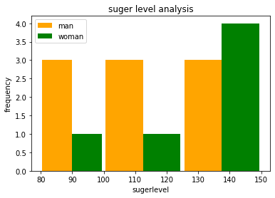
    


```python
# side by side 
import matplotlib.pyplot as plt
bloodsugerwoman=[90,105,60,75, 133, 200, 230, 125, 167, 170, 150, 145, 175,230, 165]

plt.xlabel('sugerlevel')
plt.ylabel('frequency')
plt.title('suger level analysis')

plt.hist([bloodsuger,bloodsugerwoman], bins=[80,100,125,150],rwidth=0.95,color=['orange','green'], label=['man','woman'],orientation='horizontal') 
plt.legend()
```

    /usr/local/lib/python3.7/dist-packages/numpy/core/_asarray.py:83: VisibleDeprecationWarning: Creating an ndarray from ragged nested sequences (which is a list-or-tuple of lists-or-tuples-or ndarrays with different lengths or shapes) is deprecated. If you meant to do this, you must specify 'dtype=object' when creating the ndarray
      return array(a, dtype, copy=False, order=order)
    


    <matplotlib.legend.Legend at 0x7f6b577fdd10>


    
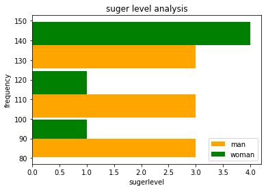
    


# Pie Chart 
- we uses this when we want to know portion each item is taking in a bucket 


```python
# i want to know out of total monthly expense what % of expense taken by which item 
dic={'home rent':3200, 'electricity bill':500, 'mobile recharge':1400, 'grossary':2000, 'food':4000}

x=dic.keys()
y= dic.values()

plt.pie(y, labels=x)
```


    ([<matplotlib.patches.Wedge at 0x7f6b572ddfd0>,
      <matplotlib.patches.Wedge at 0x7f6b5726d390>,
      <matplotlib.patches.Wedge at 0x7f6b5726da90>,
      <matplotlib.patches.Wedge at 0x7f6b57277090>,
      <matplotlib.patches.Wedge at 0x7f6b57277890>],
     [Text(0.6788619347239616, 0.8655324797965932, 'home rent'),
      Text(-0.41014216785131924, 1.0206779130314423, 'electricity bill'),
      Text(-0.8750522961913193, 0.6665459315983405, 'mobile recharge'),
      Text(-1.0471200276265697, -0.3369564478435337, 'grossary'),
      Text(0.46723012122257174, -0.9958393514128376, 'food')])


    
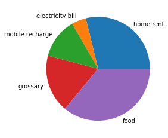
    


```python
plt.axis('equal') # to keep it round
plt.pie(y, labels=x, radius = 1.5,autopct='%f%%')
plt.show() # to get rid of text
```


    
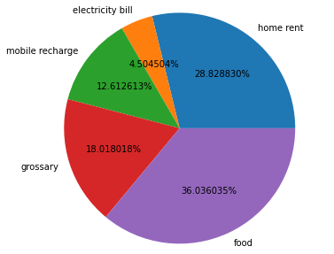
    


```python
plt.axis('equal') # to keep it round
plt.pie(y, labels=x, radius = 1.5,autopct='%0.1f%%', shadow=True)
plt.show() # to get rid of text
```


    
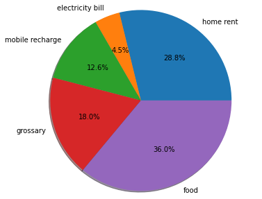
    


```python
plt.axis('equal') # to keep it round
plt.pie(y, labels=x, radius = 1.5,autopct='%0.1f%%', shadow=True, explode=[0,0,0.5,0,0])
plt.show() # to get rid of text
```


    
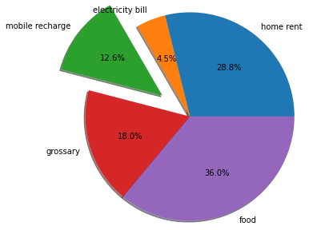
    


# Save plot to file


```python
plt.axis('equal') # to keep it round
plt.pie(y, labels=x, radius = 1.5,autopct='%0.1f%%', shadow=True, explode=[0,0,0.5,0,0])
plt.show() # to get rid of text

plt.savefig('piechart.png', bbox_inches='tight',pad_inches=2, transparant=True)
```


    

    


    <Figure size 432x288 with 0 Axes>


```python

```
